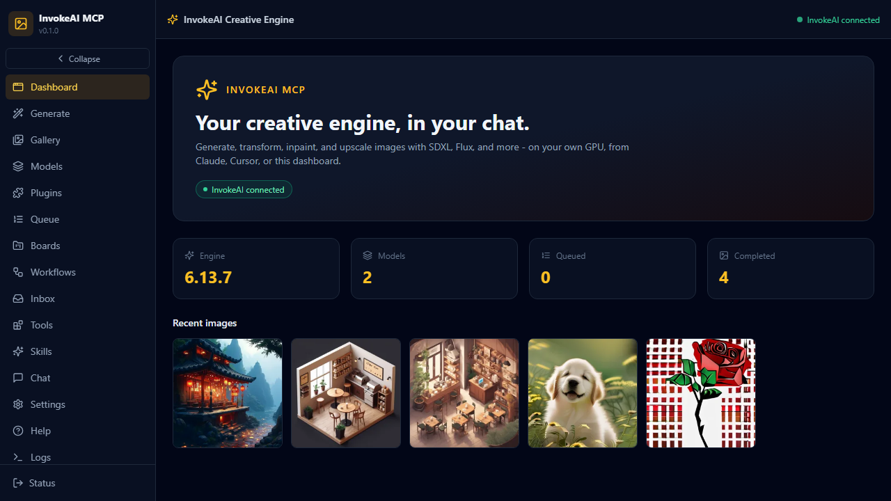
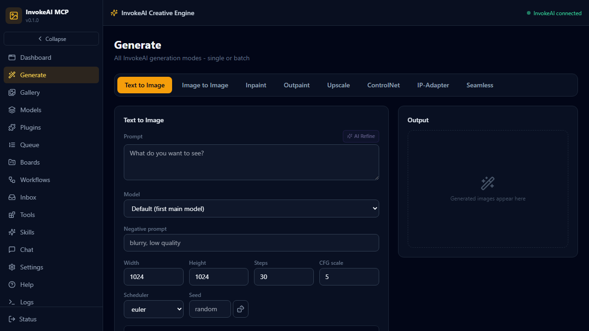

# InvokeAI MCP

A bridge between AI coding agents (Claude, Cursor, opencode) and your local
**InvokeAI** creative engine - text-to-image, image-to-image, masked inpaint,
and upscaling on your own GPU, plus full queue, model, gallery, board, and
workflow management, with a polished dark webapp.

## What this wraps

This repo wraps **InvokeAI**, the open-source professional Stable Diffusion /
Flux creative engine (Apache-2.0, 27k+ stars). InvokeAI runs as a local web
server (default `http://127.0.0.1:9090`) and is installed separately through
its launcher - it is never bundled here. See [docs/WRAPPEE.md](docs/WRAPPEE.md).

## Preview

| Dashboard | Generate |
|-----------|----------|
|  |  |

## What You Can Do

**How it runs**: headless bridge - this MCP server talks to your running
InvokeAI instance over its REST API. InvokeAI must be installed and running
(launcher install, model download, first run). Nothing is bundled.

| Direction | Artifacts | Notes |
|-----------|-----------|-------|
| **Hands-in** | prompts, negative prompts, images (img2img/inpaint), mask images, model sources | Text or uploaded images |
| **Hands-out** | generated PNGs, image URLs, local file paths, queue state | `invokeai_queue result` + gallery download |

- Generate SD1.5 / SDXL / Flux / SD3.5 / Qwen Image images on your RTX 4090
- Transform existing images (img2img) and repair regions (masked inpaint)
- 4x RealESRGAN upscaling
- Install models from HuggingFace or Civitai without leaving the chat
- Full queue control: status, cancel, clear, resume, result polling
- Gallery search, boards, star/favorite organization
- Workflow library management (save/load node workflows)
- Dark SOTA webapp: Generate, Gallery, Models, Queue, Boards, Workflows,
  Inbox, Tools, Skills, Chat (local LLM), Settings, Help, Logs

## Quick Install

The fastest path is the MCPB bundle for Claude Desktop:

1. Download `invokeai-mcp-0.1.0.mcpb` from
   [Releases](https://github.com/sandraschi/invokeai-mcp/releases/latest)
2. Open Claude Desktop and drag the file onto the window
3. Complete onboarding (install InvokeAI, download a model) - see
   [docs/ONBOARDING.md](docs/ONBOARDING.md)

Other methods (mcpb CLI, manual config, webapp dev stack) are in
[INSTALL.md](INSTALL.md).

## Example Prompts

- "Generate a neon cyberpunk city at night, rain, cinematic lighting"
- "Use this image and make it a watercolor painting:
  [gallery image]"
- "What models do I have installed? Install SDXL base from HuggingFace"
- "Show me my recent images and download the last one to disk"

## Documentation

| Doc | Contents |
|-----|----------|
| [Installation](INSTALL.md) | All install methods, prerequisites |
| [Onboarding](docs/ONBOARDING.md) | First-timer InvokeAI setup, model downloads, pitfalls |
| [Wrapped app](docs/WRAPPEE.md) | What InvokeAI is, official links, community |
| [Architecture](docs/ARCHITECTURE.md) | System architecture, graph builders, ports |
| [Configuration](docs/CONFIGURATION.md) | Env vars, config options |
| [Tool Reference](docs/TOOLS.md) | All available tools |
| [Development](docs/DEVELOPMENT.md) | Contributing, local setup |
| [Troubleshooting](docs/TROUBLESHOOTING.md) | Common issues |

## Requirements

- **InvokeAI** installed and running (launcher install; models downloaded) -
  free, Apache-2.0
- GPU with 6-12 GB VRAM recommended (SD1.5: 4 GB, SDXL: 8 GB, Flux: 12 GB+)
- Claude Desktop (or any MCP client) for chat use; a browser for the webapp
- Python 3.12+ and uv for source installs; Node/Bun for the webapp

## License

MIT
